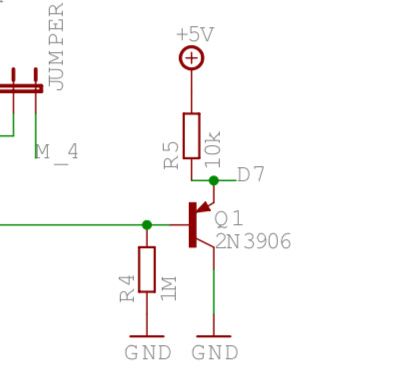
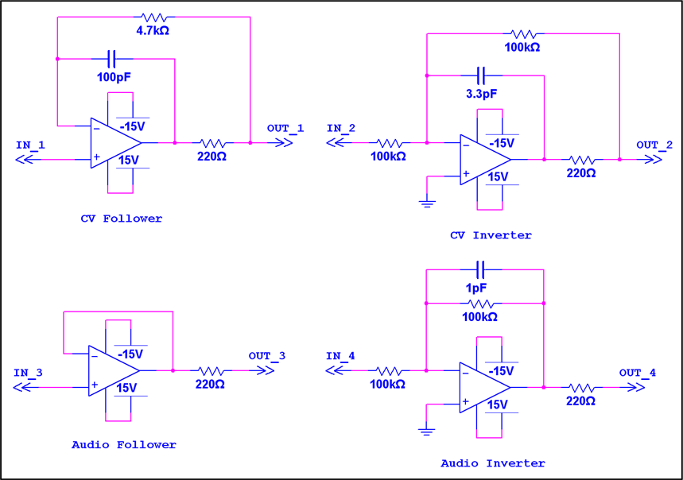

### Brief
I want to build Уurorack module with microcontroller as a brain. Probably easiest but not obvious tool is LFO.

### Main Idea and Diagram

```
┌───────┐ ┌──────────────┐                            
│Trig IN│ │Potentiometer │                            
└───┬───┘ └──┬───────────┘                            
    │        │                                        
    │        │                                        
┌───▼────────▼──┐      ┌────────┐      ┌───────┐      
│ESP8266 NodeMCU├──────► MCP4728├──────► TL074 │      
└───────────────┘      └────────┘      └┬─┬─┬─┬┘      
                                        │ │ │ │       
                                        │ │ │ ▼       
                                        │ │ │ CV out A
                                        │ │ ▼         
                                        │ │ CV out B  
                                        │ ▼           
                                        │ CV out C    
                                        ▼             
                                        CV out D          
```

I have several old esp8266 boards, so i'm using one of those. Main goal of this project is to learn to work with DAC. As a DAC i'm using very small but very powerful mcp4728 DAC. It's 12bit, but from the Web it is discussed lots of times that it is not enough for v/oct, because it is not that linear on whole voltages span. TL074 is used for buffering of outputs of DAC.


### Powering
Eurorack has +12, -12 and +5, but for 5v it needs extended cable. Also I know that not all cases have 5v, so i decided to make +5 from 12v. Conviniently, i have L7805CV to make 5 from 12. It is old and not that efficient linear regulator, but i have lots of them from Aliexpress. ESP8266 NodeMCU is powered straight from +12V bus, DAC is powered from +5V.
Opamp is powered with +12 and -12 buses.

### developing
With this project, i'm finally completely tired of Arduino IDE. It's not-developer-friendly IDE, it's fine for small projects but absence of autocomplete, code navigation and all other stuff makes me cry, especially after daily PyCharm and Atom experience. So I decided to switch and search for ggod toolchain, which ideally can fit all my needs in MCUs developing.
And i guess i found one. Platformio has a plugin to VSCode, it is fast, it has config files in INI, it has all features of modern IDE (based on VSCode) and it seems to support all possible MCUs whcih i might use.
So for now - I'm on Platformio.

### Scaling issue
Outputs of DAC is 4v at it max. I tried to scale it via opamp in 2 times, but for this momet i failed, will think of this later

### Protecting input
Levels of eurorack accoring to standard (at least Doepfer's) is -5 to +10v, which is definitely not suitable for 3.3V ESP8266 digital ins. So i'm using simple circuit to protect input - check this:

Idea is taken from muffwiggler forum.

### Buffering outputs
Also as a training I used TL074 to protect outputs of DAC. seems to be working well, done with this specific schematic, CV follower:

This is also taken from muffwiggler forum.

### Slow DAC
I feel like it can be faster. Connection protocol is I2C, so i tried to make SDC faster with this command:

```
Wire.setClock(400000L);
```
But it doesn't seem to help. What actually helped is chaning how update DAC function is called. At first i tried some typical approach with comparing difference to millis(), but it looks like each call to it is actually takes a lot of time. What really helped is to move to Ticker library, natively created for ESP to run somethinh each N seconds or milliseconds:

```
Ticker mainLoopTicker;
...
mainLoopTicker.attach_ms(5, updateDac);
```
Checking with my oscilloscope - i don't see glitches with this approach. Anyway,  frequencies is not too high and it doesn't seem to work for audio frequencies. Needs faster ESP i guess... Which supports higher I2C frequency.

### Waveforms
I don't want to generate waveforms. Best option is just to "play" it, from saved files or arrays. There is a varaiety of free waveforms pacs arounf the internet, so i took one [here](https://www.adventurekid.se/akrt/waveforms/adventure-kid-waveforms/) and worked on adding it as files to ESP8266 filesystem. Basically, it is wav; and wavs seems to be very easy stuff, with clean structure. So I read files from LittleFS (conviniently, it is very easy to create one with Platformio), find actual samples from it (uint16_t values) and play it with frequency set by trig input. Each output plays its own waveform, controlling potentiometer is fading between 2 waveforms, random on each channels. Fading is very simple:
```
if (position >= 0 and position < 1024)
{
  return (first * (1024 - position) + second * position) >> 9;
}
```
I don't want to divide so i multiply uint16_t's and then scale it down with >> 9.

### Randomness
In full clockwise position, i want to generate 4 perlin-noise waveforms. For doing this, I use:

### Making additional interesting stuff

### Syncing with trig input

### Links
Very intersting Arduino-eurorack and other stuff site:
http://pjmnc.free.fr/
Very important stuff for me, adding trig in/ trig out to arduino with this schematics: http://pjmnc.free.fr/files/arduino_io.bmp

Buttons with ESP8266
https://diyi0t.com/switches-tutorial-for-arduino-and-esp8266/

ESP8266 reference gpios:
https://randomnerdtutorials.com/esp8266-pinout-reference-gpios/

Analog IN for ESP8266:
https://www.electronicshub.org/nodemcu-esp8266-adc-tutorial/

Mozzi board-specific things are described here - https://github.com/sensorium/Mozzi

ESP8266 nuances here
https://alexgyver.ru/lessons/esp8266/
