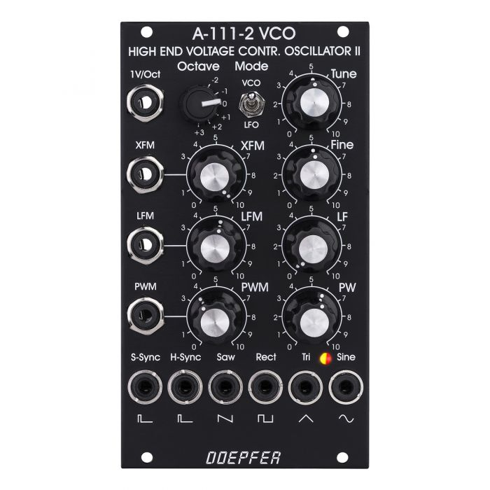

### Problem

I was contacted by a friend of mine with the following request: after re-arranging his case, several modules stopped working. I made a quic analysis and realized that prodlem occurred due to wrong polarity of one cable. Probably, this cable was connected to module without strict polarity, that is why it actually worked before.
Anyway, mostly modules had a protection, so they just didn't turn on; except for Doepfer A-111-2 VCO, which just didn't produce any sound after proper powering. Dead as dust.

### Thinking
First of all, i noticed that main sound source in this case is CEM3340 chip and oscillograph showed that it's not able to start for some reason - no output on all 4 outs. I started by trying to find faulty parts; googled for basic 3340 connection schematic and checked all parts around IC.

First, this cap got me worried so i substituted it; no luck unfortunately.

Then i founf problems with this linear voltage regulator, instead of 10V it gave smth like 0.25V on output (according to datasheet). Substituted and tested, but still it didn't solve the problem.

My last idea was that wrong polarity got to IC and therefore one of the options is to substitute IC. I even soldered basic CEM3340 schematic and tested IC in it with nio succeess - no sound. So my last option was to substitute it!

I didn't had spare part, so i contacted owner, advised with him, got his approval and ordered Curtis CEM3340 from Thonk. I had a concern that actually its different manufacturer than original Doepfer part; but - ony option was to wait.

### Solution

After three long weeks i put IC in socket and YESSS! It works now!Amazing long experience of getting back to life 300+ USD module is amazing.
