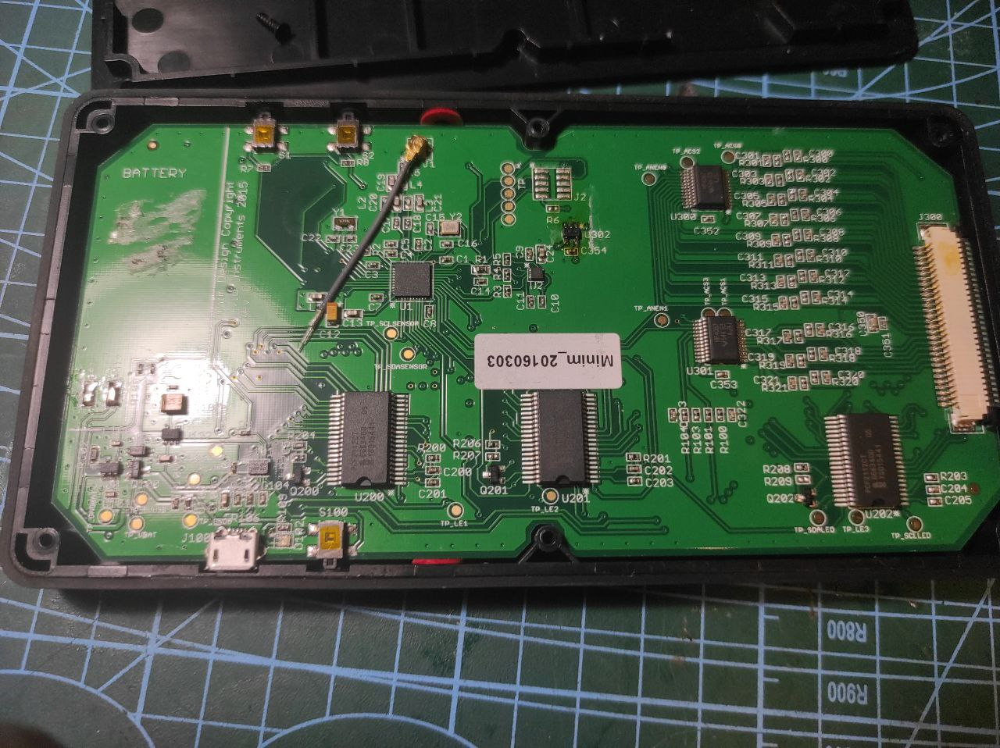
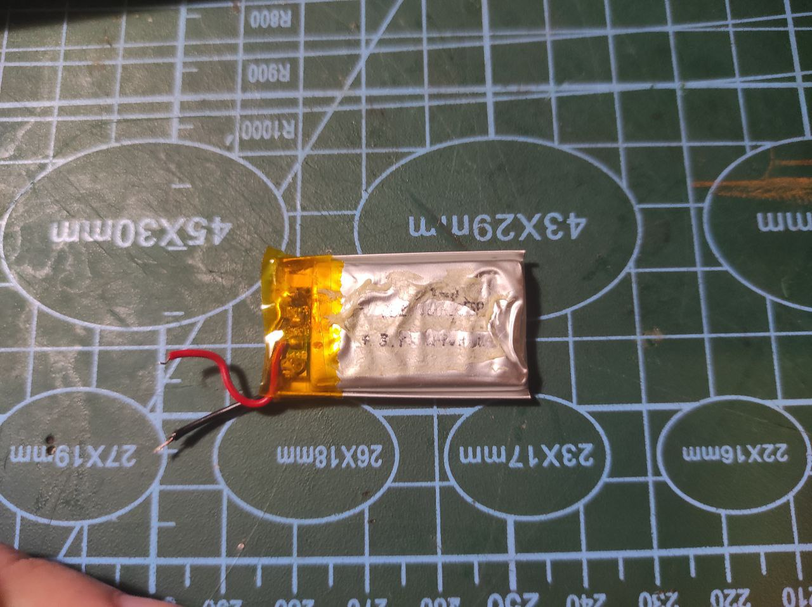
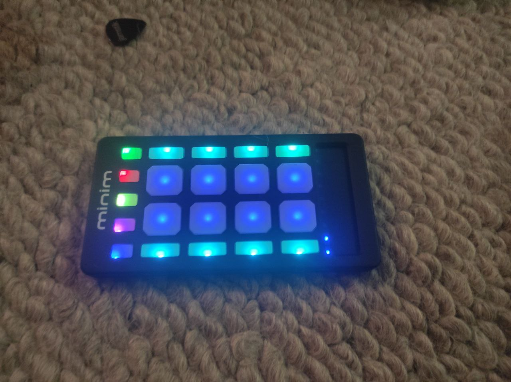

### Story
I ventured into scouring eBay for intriguing finds and stumbled upon an affordable lot featuring two small MIDI controllers. Both were listed as non-functional, but I decided to take a chance. Past experiences had shown that items labeled as "broken" often turned out to be perfectly operational. Many people tend to overlook these opportunities without delving a bit deeper. Another enticing factor was that the lot contained two identical controllers, implying that I could use one as a valuable source of spare parts for the other. So, I went ahead and seized the deal.

### Problems
The two controllers presented distinct issues. The first undoubtedly suffered from a faulty battery that failed to hold a charge. Fortunately, aside from this power-related hiccup, all other functionalities seemed to be in working order. On the other hand, the second controller was caught in a bootloader loop, illuminating all buttons sequentially and remaining unresponsive to any input.

### Livid Story
Regrettably, upon researching the manufacturer, I discovered a somber tale. The CEO of the company, who appeared to be the driving force behind everything from research and development to marketing, was diagnosed with a rare and incurable disease around 2019. Since then, it seems the company has come to a standstill. The website is partially down, essential apps have been removed from the App Store, and my assumption is that this situation is unlikely to change—Livid appears to be defunct.

### So where to look?
Unfortunately, the primary wiki containing crucial information about firmware, the editor, and device functionality is now defunct. Thankfully, some fragments have been preserved on the web archive. Here are key URLs that aided me:
[Minim Firmware Update](https://web.archive.org/web/20201008054414/http://wiki.lividinstruments.com/wiki/Minim_Firmware_Update)
[Minim User Manual](https://web.archive.org/web/20190409183512/http://wiki.lividinstruments.com/wiki/Minim)
[Minim Bluetooth Ble Connection Guide](https://web.archive.org/web/20190409114053/http://wiki.lividinstruments.com/wiki/Bluetooth_LE_MIDI_Connection)
[Minim Editor](https://web.archive.org/web/20190409003408/http://wiki.lividinstruments.com/wiki/Minim_Editor)

Additionally, crucial information about the Bluetooth connection PIN is provided: 000000 for all devices. I also located the editor [here](https://web.archive.org/web/20190409003408/http://lividinstruments.com/dl/software/minim/minim_editor_109_osx.zip), which launched without issues on MacOS Sonoma 14.1.1.

One of the devices I acquired successfully connected to the editor after its dead battery was replaced. All saving functions operated seamlessly. The previously non-functional device, now with a working battery, retains a charge for over 2 hours.

### Disassembly
The process is straightforward, requiring only the removal of six Phillips screws. Internally, a simple setup comprises one PCB, buttons, and a battery. The battery appears to be a standard 3.7V model, akin to [this one](https://rozetka.com.ua/ua/328713610/p328713610/) one, making it easily replaceable if necessary.

Swapping batteries proved uncomplicated, yielding a 100% success rate. The previously non-functional device now maintains a charge for an acceptable 2+ hours.

### Firmware
My suspicion is that the non-responsive controller might be stuck in a firmware upgrading mode. Unfortunately, the absence of support and a forum (no traces found of an existing Livid forum) makes debugging challenging, with no similar cases identified. Consequently, I opted to cease investigation in this direction.

### Result

In conclusion, the Minim is a simple, compact, battery-powered MIDI controller with a plethora of settings accessible through its editor. Despite its affordability and versatility, the lack of manufacturer support diminishes its appeal. The situation eerily resembles Keith McMillen devices, sharing a similar tinkering-style design.
